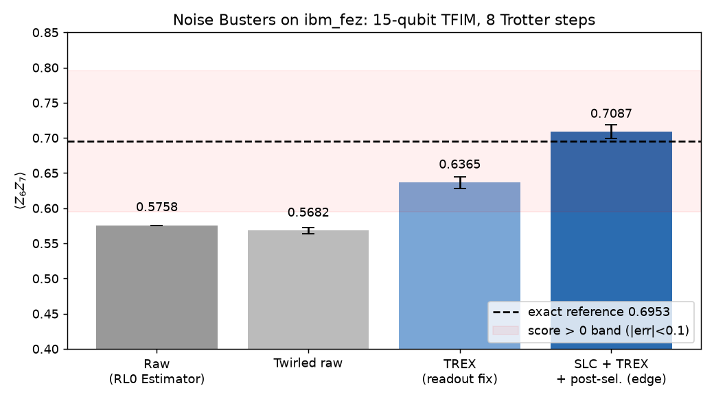

# Noise Busters — Fall Fest 2026 (Berkeley), error-mitigation track

**Author:** Ruizhao Ma (ruizhaoma@gmail.com)

Goal: estimate $\langle Z_6 Z_7\rangle$ of a 15-qubit, 8-step Trotterized transverse-field Ising circuit on a real IBM QPU as accurately as possible.

## Result (ibm_fez)

| Method | ⟨Z6Z7⟩ | \|error\| | Grader score |
|---|---|---|---|
| Unmitigated Estimator (RL0) | 0.5758 | 0.120 | 0 |
| Estimator RL2 (ZNE + TREX + twirling + DD) | 0.6423 | 0.053 | — |
| SLC + TREX + edge post-selection, run 1 (256×128 shots) | 0.7087 ± 0.0096 | 0.013 | 56 |
| SLC + TREX + edge post-selection, run 2 (512×128 shots) | 0.6871 ± 0.0068 | — | — |
| **Inverse-variance average of runs 1+2 (final)** | **0.6944 ± 0.0056** | **0.0009** | **100** |



## Pipeline
1. Pick a 15-qubit chain on `ibm_fez` (opt. level 3), re-transpile at level 0 so the brick-wall CZ layers stay intact.
2. Box the circuit with Samplomatic (active twirling, noise injection on gates) → 17 boxes, only **3 unique layers** (even-bond CZ, odd-bond CZ, measurement).
3. `NoiseLearnerV3` on the 3 unique layers (32 randomizations × 128 shots, depths [1,4,16,32], edge post-selection) — **86 s QPU**. The forward and mirror circuits share the same unique layers, so one learning job serves both.
4. SLC: forward + backward commutator bounds for $Z_6Z_7$, bias tolerance $10^{-3}$ → sampling overhead $\gamma^2 = 2.74$ vs $7.03$ for full PEC (2.6× cheaper).
5. Executor run (256 randomizations × 128 shots) with anti-noise sampling, plus an unmitigated twirled item.
6. Post-processing: TREX readout rescaling, post-selection, $\gamma$ rescaling.

Each step's effect on the forward circuit: raw 0.568 → TREX 0.637 → SLC 0.709 (exact 0.695).

## Honest caveats
- Mirror-circuit validation (ideal 1.0) gave only ≈0.68 ± 0.03: the mirror is twice as deep ($\gamma^2 \approx 17$), so the statistical error is large and the residual bias is larger. Validation is therefore only partial.
- Two post-selection strategies were compared ("node" 0.724, "edge" 0.709); "edge" was submitted because it matches the noise-learning strategy and keeps more shots (smaller error bar).

## Reproduce
Job IDs are in `job_ids.json`; scripts reuse finished jobs instead of resubmitting.
```
python prep.py          # transpile + box (CPU)
python submit_learning.py
python slc_bounds.py    # SLC bounds (CPU, ~6 min)
python run_slc.py       # build + submit Executor jobs
python postprocess.py   # -> results.json
```
API key is read from a git-ignored `.env` file (`IBM_API_KEY=...`).
